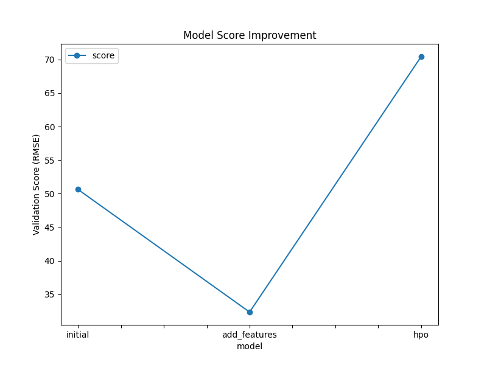
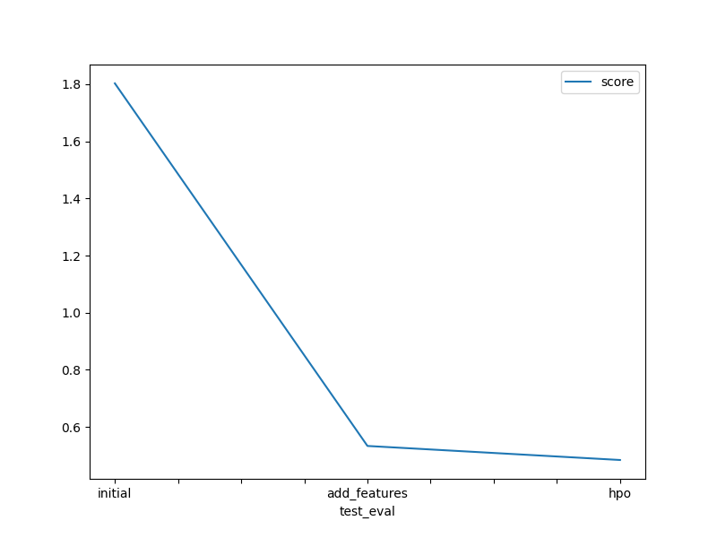

# Report: Predict Bike Sharing Demand with AutoGluon Solution
#### Veronica Dwiyanti

## Initial Training
### What did you realize when you tried to submit your predictions? What changes were needed to the output of the predictor to submit your results?
The predictions included negative values, which are invalid for bike counts. I fixed this by setting all negative predictions to zero using predictions[predictions < 0] = 0.

### What was the top ranked model that performed?
The top-ranked model was LightGBM_BAG_L2.

## Exploratory data analysis and feature creation
### What did the exploratory analysis find and how did you add additional features?
I noticed hourly patterns and weather factors likely affected demand. I extracted the hour from datetime and created new categorical features: rush_hour, temp_category, wind_category, and humidity_category.

### How much better did your model preform after adding additional features and why do you think that is?
The Kaggle score improved from 1.80291 to 0.53349, showing that the model better understood temporal and weather-based patterns influencing bike usage.

## Hyper parameter tuning
### How much better did your model preform after trying different hyper parameters?
With tuning, the score improved to 0.48491. Tuning helped the model generalize better by optimizing learning rate and model complexity.

### If you were given more time with this dataset, where do you think you would spend more time?
I would explore time series modeling techniques and combine registered/casual counts separately.

### Create a table with the models you ran, the hyperparameters modified, and the kaggle score.
|model|hpo1|hpo2|hpo3|score|
|--|--|--|--|--|
|initial|-|-|-|1.80291|
|add_features|-|-|-|0.53349|
|hpo|0.05|6|150|0.48491|

### Create a line plot showing the top model score for the three (or more) training runs during the project.

TODO: Replace the image below with your own.

### Create a line plot showing the top kaggle score for the three (or more) prediction submissions during the project.

TODO: Replace the image below with your own.

## Summary
In this project, I used AutoGluon to build models for predicting bike sharing demand. Starting with a basic model, I gradually improved the results by engineering new features like rush hour and temperature categories. This resulted in a major improvement in the public Kaggle score. Next, I performed hyperparameter tuning to further optimize the model. The final score went from 1.80291 (initial model) to 0.48491 (after tuning), demonstrating the power of feature engineering and model tuning. 
AutoGluon simplified the process, allowing fast iteration and comparison of models. If given more time, I would explore segmenting the target variable, tuning for specific time windows (e.g., weekdays vs weekends) and experimenting with ensemble learning across time series models.
